# PROJET DONNÉES - DÉPÔT LÉGAL DU WEB

Ce projet a été réalisé par Anahi Haedo, Paul Kervegan et Kristina Konstantinova dans le cadre du cours de Données du master 
TNAH de l'École des Chartes (promotion 2021-2022).

---

## STRUCTURE DU DÉPÔT

L'export de Dataiku lui-même n'est pas présent sur ce dépôt: il est trop lourd pour être stocké gratuitement sur github.

- `racine du dossier` : la licence et le présent document
- [`images`](images) : un dossier contenant des images utilisées pour le présent document
- [`sparql`](sparql) : le dossier contenant toutes les données des requêtes sparql
	- [`sparql_out_databnf`](sparql/sparql_out_databnf) : les résultats des requêtes menées sur Data BnF
	- [`sparql_out_wikidata`](sparql/sparql_out_wikidata) : les résultats des requêtes menées sur Wikidata
	- [`sparql_requests_databnf`](sparql/sparql_requests_databnf) : les requêtes menées sur Data BnF
	- [`sparql_requests_wikidata`](sparql/sparql_requests_wikidata) : les requêtes menées sur Wikidata
- [`urltoip`](urltoip) : le script permettant de récupérer des adresses IP à partir d'une URL
- [`visualisations`](visualisations) : les datasets utilisés pour réaliser des visualisations

---

## PRÉSENTATION GÉNÉRALE DU PROJET

Notre projet porte sur le Dépôt légal du web, organisé par la BNF. Ce dépôt étant organisé thématiquement, nous avons choisi
de travailler sur la collecte Littérature et Art effectuée entre 2011 et 2020. Les données de cette collecte sont disponibles sur
[Data.gouv.fr](https://www.data.gouv.fr/fr/datasets/collectes-thematiques-du-web-par-la-bnf/) et diffusées sous licence libre.

La collecte Littérature et art regroupe des sites sélectionnés par le département Littérature et art de la Bibliothèque 
nationale de France.

---

## DESCRIPTION DES JEUX DE DONNÉES

Notre dataset initial est constitué de 5 fichiers CSV correspondant à 5 phases de collecte (2011-2016, 2017, 2018, 
2019, 2020), soit un total de 19529 entrées. Chaque entrée correspond à un site collecté, et plusieurs sites sont requêtés
plusieurs années de suite. Chaque entrée est classifiée à l'aide d'un thème issu d'un vocabulaire contrôlé 30 thèmes : 
art, littérature française, francophone, étrangère et jeunesse, bibliothéconomie, linguistique, bandes dessinés, éditeurs... 
Plusieurs mots clés servent également à décrire les sites. Ces termes ne font pas partie d'un vocabulaire contrôlé; 
il y a donc 8196 mots clés en tout. En plus des mots clés, la fréquence à laquelle les sites sont collectés est également
renseignée. Deux champs complémentaires servent à indiquer des informations descriptives et à donner un historique des URLs. 

---

## OBJECTIFS

Le jeu de données est très riche, autant du point de vue thématique que du point de vue chronologique, puisqu'il représente
10 ans de sites internet, ce qui n'est pas négligeable au vu des évolutions qu'a connu le web. Nous avons donc choisi d'étudier
le dataset en suivant plusieurs axes :
- **Un axe chronologique**. Ccomment le web a-t-il évolué sur 10 ans ? Les thématiques des sites collectées ont-elles évolué 
sur cette période ? Qu'en est-il des sites requêtés : comment la proportion de blogs, de réseaux sociaux et de sites académiques 
a t-elle évolué ?
- **Un axe thématique**. Comment les thématiques requêtées s'organisent-elles entre elles ? Est-ce que la répartition des sites
web par thématique est représentative de la production ou de la consommation culturelle ? Nous avons enfin voulu relier nos données
à des sources externes d'information, en récupérant notamment des liens vers les pages Wikipedia des mots clés les plus utilisés.
Cette partie s'appuie fortement sur des données externes récupérées avec Sparql sur [Data BnF](https://data.bnf.fr/) et 
[Wikidata](https://www.wikidata.org/wiki/Wikidata:Main_Page) ainsi que sur un dump du Ministère de la Culture récupéré sur 
[Data.gouv.fr](https://www.data.gouv.fr)
- **Un axe géographique**. Nous sommes parti.e.s de l'idée que le dépôt légal du web de la BnF représentait "l'internet français".
À partir de cette idée, nous sommes arrivé.e.s à un questionnement simple: d'un point de vue géographique, l'internet français
est-il réellement français ? Pour répondre à cette question, nous avons écrit un script Python qui récupère les adresses IP liées
à des URLs grâce au *Domain Name System*. La localisation des adresses IP extraites a été traduite en données géographiques avec
Dataiku. 

---

## ENRICHISSEMENTS EXTÉRIEURS À DATAIKU

Dans cette partie, nous expliquons le travail d'enrichissement réalisé à l'extérieur de Dataiku (tous les scripts utilisés sont
fournis dans ce dépôt et documentés), afin de ne pas alourdir le descriptif de la chaîne de traitement ci-dessous.

### Création d'un script Python pour récupérer les adresses IP

Notre objectif de compléter les URLs présentes dans notre dataset en extrayant les adresses IP auxquelles elles renvoient.
Malgré de nombreux essais, nous n'avons pas réussi à utiliser Python à l'intérieur de Dataiku, en partie à cause d'une difficulté
à prendre en main la librairie `pandas`. Nous avons donc exporté une version nettoyée du dataset principal afin d'y appliquer
un script Python localement. Le script `urltoip.py` (disponible [ici](urltoip/urltoip.py)) est relativement simple : en utilisant
la librairie [`dnspython`](https://www.dnspython.org/), il boucle sur chaque URL du jeu de données et extrait les adresses IP si 
elles existent. Si une erreur a lieu, alors le script produit un message d'erreur qui permet de savoir quel type d'erreur a eu 
lieu :
- `timeout` si l'adresse IP a été retrouvée, mais n'a pas répondu à temps
- `lien mort`, si le DNS ne retourne pas de résultat : cela veut dire que l'URL n'est plus attribuée
- `àutre erreur`, si une autre erreur a été rencontrée.

Ces données sont ensuite écrites dans un fichier CSV qui associe à chaque URL, une adresse IP ou un message d'erreur. Le fichier
a ensuite été ajouté à Dataiku et une jointure a été faite sur le dataset principal.

### Requêtes sur Data BnF et Wikidata avec Python

Pour enrichir les datasets, des requêtes SPARQL ont été lancées sur DataBNF et Wikidata pour récupérer des informations
supplémentaires sur tous les thèmes et sur les mots clés utilisés sur plus de 0,5% du dataset (respectivement). Les mêmes
requêtes étant lancées en boucle sur des termes différents, l'utilisation de python a servi a automatiser le processus. Les
termes requêtés sont stockés dans un dictionnaire ; on boucle sur chaque terme pour construire une requête adaptée, avant de
lancer la requête grâce à la librairie [`SPARQLWrapper`](https://sparqlwrapper.readthedocs.io/en/latest/main.html) et
d'enregistrer les résultats. Suivant ce principe, deux scripts ont été écrits: un pour [lancer des requêtes sur les mots clés 
dans Wikidata](sparql/sparqlmaker_wikidata.py) et un pour [faire des requêtes sur les thèmes dans Data BnF](sparql/sparqlmaker_databnf.py).
Dans les deux cas, un document Markdown permet de faire le lien entre les requêtes et les données du tableur :
- [un premier fichier](sparql/sparql_wikidata.md) relie à chaque mot clé retenu son équivalent dans Wikidata et son identifiant
- [un second fichier](sparql/sparql_databnf.md) associe chaque thème de notre dataset son équivalent dans DataBnF et son URI pour
lancer les requêtes.

Ainsi, il est possible de savoir à quelle donnée de notre dataset correspondent les termes requêtés.

Une seule requête est lancée sur chaque mot clé dans **Wikidata**. Celle ci est exportée en JSON; ce format est converti
en CSV dans Dataiku et les différents fichiers sont "empilés" (*stacked*) afin de n'avoir qu'un seul fichier. Cette
requête permet de récupérer : 
- `?id`: l'identifiant du mot clé dans wikidata
- `?labelFR`: le nom du mot clé dans wikidata en français
- `?labelEN`: le nom du mot clé dans wikidata en anglais
- `?instanceOFlabel`: les noms des entités dont le mot clé est l'instance, en anglais
- `?partOFlabel`: le nom des entités dont le mot clé fait partie, en anglais
- `?countFOW`: le nombre de personnes morales/physiques qui ont le mot clé comme domaine de travail/étude
- `?countINS`: nombre d'instances du mot clé
- `?wikidataURL`: l'URL wikidata
- `?wikipediaFR`: un lien vers la page wikipedia en français, si elle existe
- `?wikipediaEN`: un lien vers la page wikipedia en anglais, si elle existe 

Sur **Data BnF**, trois requêtes sont lancées pour chaque mot clé (pour éviter que la durée n'excède la durée maximale autorisée
pour une requête - 1 minute - il a fallu diviser les requêtes en 3). Pour chaque thème, le script lance les trois requêtes et
produit 3 CSV (disponibles [ici](sparql/sparql_out_databnf)) : `sparql_main|broader|narrower_out_*_databnf.csv` (avec `broader`
pour les requêtes cherchant à récupérer les termes génériques d'un thème, `narrower` pour récupérer les termes spécifiques
et `main` pour le reste. L'un des objectifs de ces requêtes était de récupérer les termes spécifiques d'un terme, seulement 
si ces termes specifiques faisaient partie des thèmes dans notre dataset principal. Ces requêtes permettent aussi de récupérer :
- `?label` : le nom du thème requêté dans databnf
- `?uri` : l'uri de ce thème
- `?cntAUT` : le nombre d'auteur.ice.s lié.e.s au thème
- `?ctnDOC` : le nombre de documents liés au thème
- `?labelRTD` : les noms des termes liés au thème requêté qui figurent aussi dans le dataset
- `?uriRTD` : les uris des termes liés au thème requêté qui figurent aussi dans le dataset
- `?uriNRW` : l'URI des termes spécifiques du thème requêté qui figurent également dans la liste des thèmes
- `?labelNRW` : le nom des termes spécifiques
- `?uriBRD` : l'URI des termes génériques du thème requêté qui figurent également dans la liste des thèmes
- `?labelBRD` : le nom des termes génériques

L'ensemble des fichiers produits et utilisés pour les deux requêtes sont **conservés dans [ce dossier](sparql)**.
- Les requêtes Wikidata se trouvent [ici](sparql/sparql_requests_wikidata)
- Les requêtes Data BnF se trouvent [ici](sparql/sparql_requests_databnf)
- Les résultats des requêtes DataBnF se trouvent [ici](sparql/sparql_out_databnf)
- Les résultats des requêtes Wikidata se trouvent [ici](sparql/sparql_out_wikidata). 

---

## CHÂINE DE TRAITEMENT DATAIKU

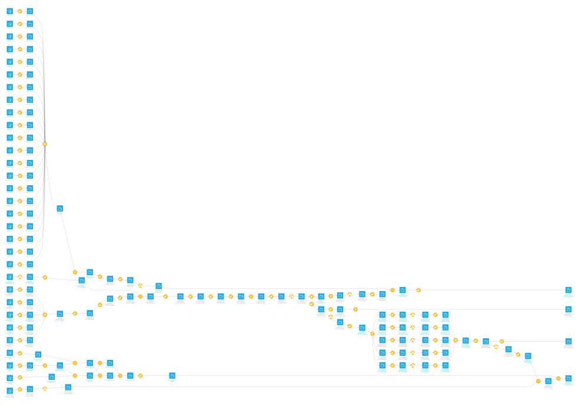

Au total, la chaîne de traitement est composée de 126 datasets et 91 recettes. Globalement, nous avons préféré produire plusieurs
petits datasets à partir du dataset principal (pour mettre en avant des données spécifiques et faire des jointures avec les
datasets externes) plutôt que de gonfler au maximum le dataset origin. En plus du dataset principal à l'état définif, il y 
a donc plusieurs autres jeux de données: quelques jeux préparant des visualisations, un jeu reliant les données Wikidata aux
notres et un jeu qui associe des données issues de Data BnF, un dump du Ministère de la culture et notre jeu de données
principal. Dans dataiku, les différents jeux de données ont été "tagués" pour indiquer leur rôle dans le *flow*.
Comme on le voit ci-dessus, la chaîne de traitement est assez complexe et / ou chaotique. Voici donc une description des 
différentes étapes, avec pour chaque étape une capture d'écran montrant la partie du *flow* qui correspond.

---

### Étape 1

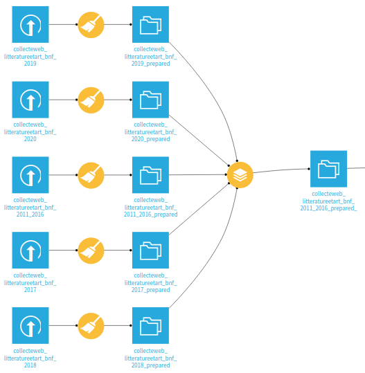

La première étape correspond à *empiler* ("stack") les datasets récupérés sur Data.gouv.fr : comme dit plus haut, nous avions
récupéré 5 datasets correspondant aux collectes de différentes années et nous avons ensuite dû les réunir en un seul dataset, 
en ajoutant les années correspondantes.

---

### Étape 2

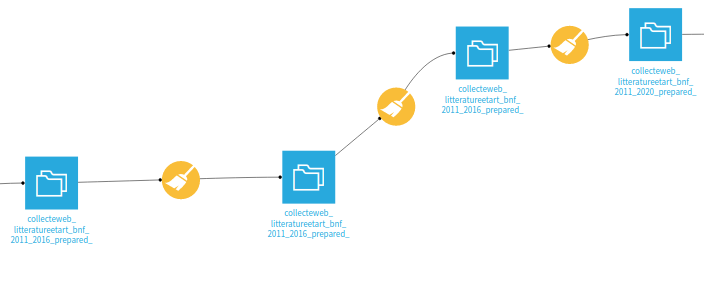

En fait, le dataset n'a pas été modifié durant cette étape. Nous avons essayé de plusieurs manières différentes d'utiliser
Python dans Dataiku pour récupérer les adresses IP (sans y arriver). Comme nous découvrions encore le logiciel, nous n'avons
pas pensé à supprimer ces étapes. À l'issue de ces étapes, le dataset a été exporté en CSV.

---

### Étape 3

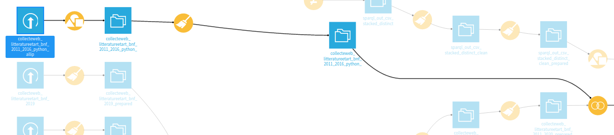

Le dataset exporté à l'étape précédente a été utilisé comme entrée d'un script Python servant à associer à chaque URL une
ou plusieurs adresses IP (le processus a été détaillé plus haut). Ensuite, une jointure a été faite avec le dataset principal
pour enrichir celui-ci.

---

### Étape 4

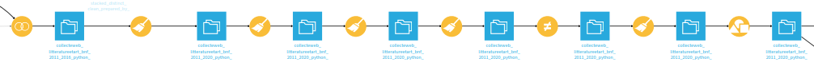

Cette étape correspond à la phase principale de nettoyage et d'analyse du dataset principal.
- à partir des adresses IP ont été extraites plusieurs données géographiques à l'aide de la fonction `Geo-Locate IP`
de Dataiku. Ont notamment été récupérés: la longitude et latitude des adresses IP, le nom du pays, de la région et 
de la ville des adresses IP (si ces données sont disponibles).
- en scindant les URLs en domaines, sous-domaines..., nous avons repéré les noms de domaines les plus utilisés. À partir de là, 
nous avons marqué (*flagged*) les URLs correspondant à des blogs, des comptes de réseaux sociaux ou des sites académiques.
- nous avons normalisé les mots clés: d'abord nous les avons séparés en de nouvelles lignes (il pouvait en y avoir des fois 
plus de quatre ensemble, séparés par des `/`. Nous les avons ensuite tous mis au singulier et en minuscule. Ensuite,
nous avons continuer à normaliser en utilisant des expressions régulières.
- ensuite a eu lieu une longue étape de "clusterisation" où nous avons rassemblé les mots clés proches (`Revues en ligne` et 
`Revues` ont été réunis sous le temre `revue (en ligne ou non)`). L'objectif était de diminuer la masse de mots clés et d'éviter
les redondances.
- nous avons extraits tous les noms propres dans une nouvelle colonne. Grâce à l'étape de "clusterisation", nous avions réussi
à normaliser l'orthograhe de la majorité des noms propres dans cette ordre «Nom, prénom », suivis des dates de vie si il y en 
avait. Nous avons ensuite pu extraire les noms propres avec des expressions régulières.
- pour finir, nous avons supprimé des colonnes "en trop" et groupé le dataset par année et URLs pour le ramener à sa forme de
départ.

---

### Étape 5

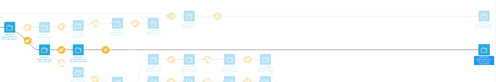

Ici, nous avons renettoyé le dataset de départ pour arriver à son état définitif et avoir un dataset "au propre" que nous
pourrions utiliser pour des visualisations. Nous avons principalement scindé le tableur par les adresses IP afin de n'avoir
qu'une adresse IP par ligne et renommé des colonnes.

---

### Étape 6

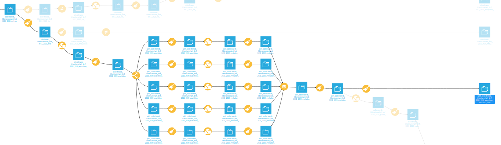

Cette étape un peu complexe correspond à la préparation d'un jeu de données spécifique, issu du dataset principal. L'objectif
était de pouvoir extraire des statisiques du dataset dans le dataset. Cette étape a permis de produire un dataset pour faire
des visualisations et un dataset à joindre avec le dump du Ministère de la culture et les requêtes de Data BnF.
- Nous avons calculé le nombre de sites académiques, de réseaux sociaux et de blogs collectés par la BnF chaque année. À partir
de ces chiffres absolus, nous avons calculé des pourcentages.
- Nous avons aussi cherché à compter les occurences des différents thèmes chaque année.
- Nos ordinateurs ayant une puissance limitée, il a été nécéssaire de faire un `split by "année"` pour faire certaines étapes.

---

### Étape 7 

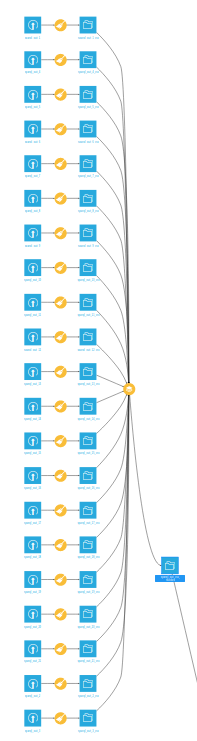

Ici, nous avons importé les résultats des requêtes lancaées sur Wikidata. Wikidata ne permettait qu'un export en JSON, et
nous avons donc dû importer chaque résultat individuellement et le convertir en CSV avant d'empiler (`stack`) les résultats.

---

### Étape 8

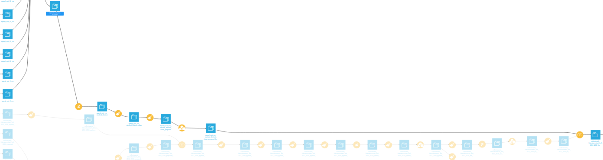

Cette étape correspond à la préparation des données issues de Wikidata pour une jointure avec notre dataset principal. Les 
mots clés comme ils sont écrits dans notre jeu de données principal ont été associés aux termes de Wikidata pour avoir champ
sur lequel faire la jointure entre les jeux de données. Nous avons également fait un `group by` afin de n'avoir qu'une ligne 
par terme.

---

### Étape 9

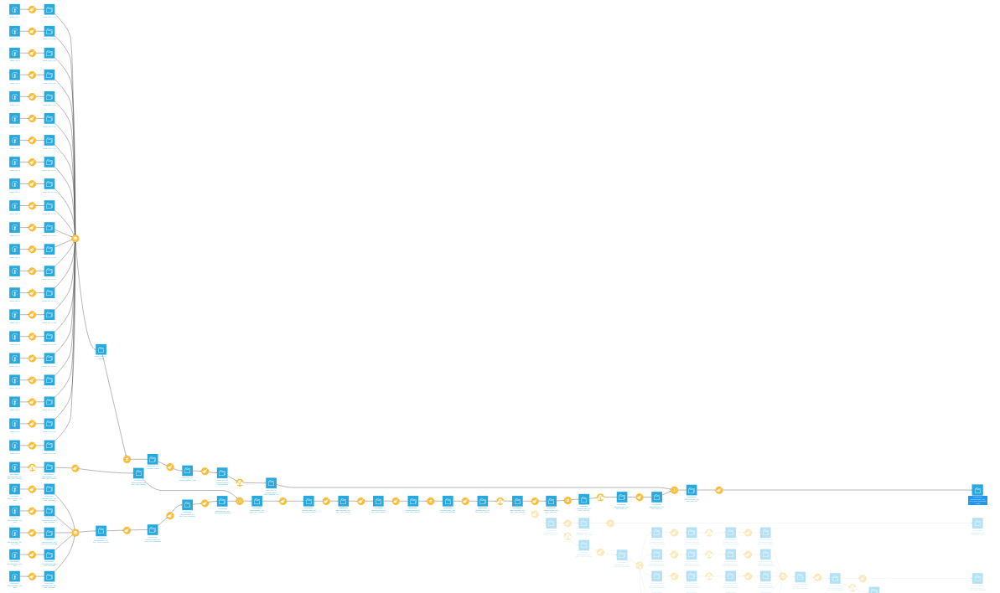

L'étape 9 correspond à la jointure et au nettoyage du dataset principal avec les données issues de Wikidata. En plus du nettoyage,
nous avons retraité les données issues de Wikidata et nos données pour pouvoir les comparées entre elles : 
- un pourcentage des URLs qui correspondent à chaque thème par rapport au total des URLs a été calculé (`url_de_départ_percent`)
- de même, un pourcentage des "instances" d'un terme Wikidata par rapport au total des instances a été calculé
(une instance est un objet qui est identifié comme un élément précis d'un champ ou domaine : toutes les bandes dessinées 
sont des instances de `bande dessinée`, par exemple) (`w_percent_instance_of`)
- ensuite, un pourcentage des personnes travaillant sur un domaine requêté a été calculé (`w_percent_instance_of`)
- enfin, pour faciliter la comparaison entre
	- le nombre d'URLs collectés pour chaque thème par le dépôt légal
	- le nombre de personnes travaillant sur un domaine
	- le nombre d'instances d'un terme requêté,

des ratio ont été calculés. Le thème du dataset principal ayant le moins d'URLs qui lui sont associés prend la valeur `1`, et la valeur des autres ratios
est calculé en fonction du multiplicateur qui permet d'obtenir cette valeur `1`. Par exemple, si un thème a un ratio de `3`, cela
veut dire qu'il y a 3 fois plus d'URLs sont associés à ce thème qu'au thème le moins représenté sur ce dataset. À partir de là,
des ratios sont calculés pour les données de Wikidata (nombre instances d'un terme et nombre de personnes travaillant dessus).
Les ratios apparaissent dans les colonnes ayant `ratio` dans leur nom.

---

### Étape 10

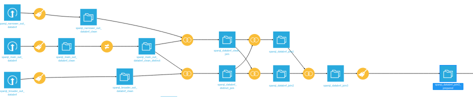

Nous avons importé les résultats des différentes requêtes faites sur Data BnF. Data BnF permettant l'export en CSV, nous avons
pu empiler (`stack`) les résultats au moment de l'import pour n'avoir que 3 jeux de données de Data BnF au départ. Nous avons
ensuite filtré les jeux de données pour ne garder les termes spécifiques, génériques et les termes liés seulement si ceux-ci
faisaient partie de notre dataset. 
- Nous devions joindre 3 jeux de données sans avoir de perte; Dataiku ne permettant pas de
`full join` avec notre modèle de données, nous avons dû reproduire un `full join` à la main. C'est pour ça que le `flow` à cette
étape ressemble à une vouture d'église... 
- Ensuite, nous avons préparé le jeu de données pour une jointure avec notre dataset principal, notamment en créant une colonne
`thème` sur laquelle faire la jointure. La jointure a été faite avec une version réduite de notre dataset principal, issue 
de l'étape 6.

---

### Étape 11

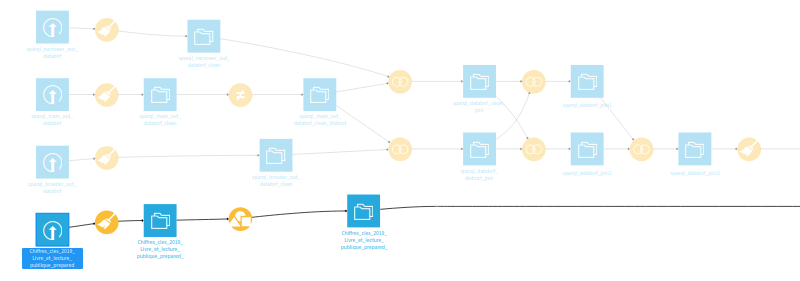

Cette étape correspond à la préparation d'une partie d'un dump du Ministère de la culture avec le jeu de données principal et
les données requêtées sur Data BnF. Ce dataset, qui représente les ventes de livres par sujet en 2017, nous semblait pertinent
puisqu'il permettrait de comparer ce qui est collecté par le dépôt du web avec ce qui est consommé par les lecteur.ices (est-ce
que la proportion de livres lus pour un thème correspond à la proportion de sites requêtés?). Cependant, ce dataset est assez 
limité et s'appuie sur une nomenclature assez différente de celle de notre jeu de données. Il a donc été difficile de l'exploiter
pleinement; nous avons cependant choisi de les garder, pour avoir une idée des ventes associées à certaines thématiques.

---

### Étape 12

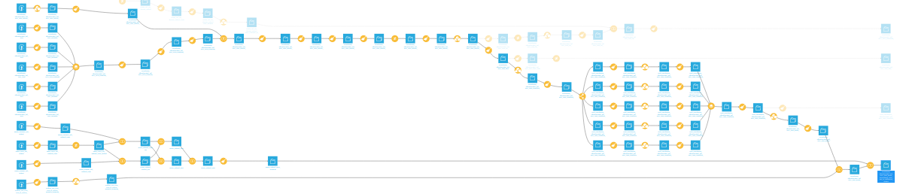

Cette étape correspond à la jointure entre notre jeu de données principal, les données de Data BnF et le dump du Ministère de
la culture. 
- Le dataset principal a été retraité pour transformer les données absolues (nombre de sites académiques, de réseaux sociaux,
décompte de chaque thème par an...) en données relatives. L'objectif était de faciliter la comparaison entre les données des
autres datasets et le dataset principal.
- À l'étape `compute_collecteweb_litteratureetart_bnf_2011_2020_group_pourdatabnf`, le `group by` a causé certaines erreurs
logiques qui ont été corrigées lors de l'étape de nettoyage suivante.
- La jointure a été faite en deux temps, comme le montre le `flow`.

---

## DESCRIPTIF DES DATASETS DÉFINITIFS

**`collecteweb_litteratureetart_bnf_2011_2020_final_clean_distinct `** : le dataset principal dans son état définitif.
- `url_de_départ` : les URLs requêtés
- `année_collecte` : l'année de collecte
- `url_de_départ_reseau_social_flag` : une colonne marquant (`flag`) les réseaux sociaux (instagram, facebook...)
- `url_de_départ_site_academique_flag` : une colonne marquant (`flag`) les sites liés à des universités
- `url_de_départ_blog_flag` : une colonne marquant (`flag`) les blogs (blogspot, skyblog...)
- `nb_adresses_ip` : le nombre d'adresses IP associées à chaque URL
- `adresses_ip_concat` : les adresses IP associées à chaque URL
- `geoip_*` : les colonnes où ont été extraites depuis les adresses IP des données géolocalisées
- `collecte` : la collecte dont sont issus les URLs du dataset
- `thème` : le thème principal d'un site URL (issu d'un vocabulaire contrôlé)
- `mots_clés` : les mots clés avec lesquels les sites webs sont indéxés
- `mots_clés_nomspropres` : une colonne où sont extraits à l'aide de regex les noms propres figurant dans les mots clés
- `fréquence` : la fréquence à laquelle sont collectés les sites
- `informations_descriptives_complémentaires_concat` : des informations descriptives sur les URLs
- `historique_des_url_concat` : colonne servant à indiquer des changements d'URL

**`split_collecteweb_litteratureetart_bnf_2011_2020_evolution_valcounts_final `** : un jeu de données associant, pour chaque 
année, le compte (en nombres absolus et en pourcentages) de sites académqiues/blogs/réseaux sociaux et de thèmes.
- `année_collecte` : l'année de collecte
- `url_de_départ_count` : le décompte (en nombres absolus) des URLs requêtés chaque année
- `reseau_social_count` : le décompte de réseaux sociaux par an
- `site_academique_count` : le décompte de sites académiques et universitaires par an
- `blog_count` : le décompte des blogs par an
- `blog_percent` : le pourcentage des blogs par rapport au total d'URLs, par an
- `site_academique_percent` : le pourcentage de sites académiques par rapport au total d'URLs, par an
- `theme` : les thèmes utilisés chaque année
- `occurence_annuelle_theme` : le nombre d'URLs associés à chaque thème, par an
- `percent_theme` : le pourcentage d'URLs associés à chaque thème, par rapport au total d'URLs, par an

**`collecteweb_litteratureetart_bnf_2011_2020_wikijoined_clean `** : un jeu de données qui fait la jointure entre chaque mot clé
utilisé dans plus de 0,5 % du dataset principal, son équivalent dans wikidata et des données extraites de wikidata. Toutes
les colonnes contenant des données issues de wikidata ont pour préfixe `w_`.
- `mots_clés` : les mots clés, issus du dataset principal
- `w_wikidata_id` : l'identifiant wikidata du terme
- `w_labelEN` : le nom du terme en anglais, dans wikidata
- `w_labelFR` : le nom du terme en français, dans wikidata
- `w_wikipedia_url_EN` : l'URL de la page wikipedia de ce terme, en anglais
- `w_wikipedia_url_FR` : l'URL de la page wikipedia de ce terme, en français
- `w_wikidata_url` : l'URL wikidata de ce terme
- `w_instance_of` : les termes dont un mot clé est l'instance (équivalent d'un terme générique)
- `url_de_départ_count` : le total d'URLs pour chaque terme
- `w_count_instance_of` : le total d'entités wikidata qui sont l'instance du terme requêté
- `w_count_field_of_work` : le total d'entités wikidata qui ont pour domaine de travail le terme requêté
- `url_de_départ_percent` : le pourcentage d'URL associées à un mot clé, par rapport au total d'URLs
- `w_percent_instance_of` : le pourcentage d'`ìnstance of` pour un terme, par rapport au total d'`instances of`
- `w_percent_field_of_work` : le pourcentage de personnes ayant pour domaine d'activité le terme requêté, par rapport au total
de `field of work` pour tous les thèmes
- `url_de_départ_ratio` : le ratio des URLs par thème, en fonction du thème ayant le moins d'URLs associés (le terme le moins
répandu a une valeur de `1`) ; pour la méthode de calcul, voir les `formulas` pour le calcul des ratio et la description de 
l'étape 9.
- `w_ratio_instance_of` : le ratio des instances d'un terme. Pour permettre la comparaison avec `url_de_départ_ratio`, le 
multiplicateur utilisé est le même que celui qui permet de calculer `url_de_départ_ratio`
- `w_ratio_field_of_work` : la même chose que `w_ratio_instance_of`, mais pour `field of work`

**`collecteweb_litteratureetart_bnf_2011_2020_group_pourdatabnf_clean_join_w_chiffrescles_databnf`** : la jointure entre 
le dataset principal, les données extraites de Data BnF et du dump du Ministère de la culture. Toutes les données de Data BnF
ont pour préfixe `d_` et toutes les données issues du dump ont pour préfixe `chiffrescles`
- `thème` : les thèmes, issus du dataset principal
- `occurences_themes_moyenne_annuelle` : le nombre moyen de fois que ce thème est utilisé tous les ans
- `reseaux_sociaux_moyenne_annuelle` : le nombre moyen de réseaux sociaux par an
- `sites_academiques_moyenne_annuelle` : le nombre moyen de sites académiques par an
- `blogs_moyenne_annuelle` : le nombre moyen de blogs par an
- `blogs_percent_moyenne_annuelle` : le pourcentage moyen de blogs par an
- `sites_academiques_percent_moyenne_annuelle` : le pourcentage moyen de sites académiques par an
- `reseaux_sociaux_percent_moyenne_annuelle` : le pourcentage moyen de comptes de réseaux sociaux par an
- `chiffrescles_domaines` : les noms des domaines pertinentes du dump du ministère de la culture
- `chiffrescles_nombre_ventes_sum` : le nombre de ventes par domaines, en nombres absolus
- `chiffrescles_evolution_2016-2017_percent_avg` : le pourcentage d'évolution des ventes par domaine entre 2016 et 2017
- `chiffrescles_evolution_2016-2017_million_euros` : l'évolution du chiffre d'affaires en millions d'euros entre 2016 et
2017, par domaine
- `d_label` : le nom des thèmes requêtés dans Data BnF
- `d_uri` : les URIs des thèmes dans Data BnF
- `d_count_auteurs` : le nombre d'auteurs par thème
- `d_count_documents` : le nombre de documents par thème dans Data BnF
- `d_termes_associes_uri` : l'URI des termes associés au thème requêté dans Data BnF \*
- `d_termes_associes_label` : le nom des termes associés au thème requêté dans Data BnF \*
- `d_termes_generiques_uri` : l'URI des termes génériques du terme requêté dans Data BnF \*
- `d_termes_generiques_label` : le nom des termes génériques du terme requêté dans Data BnF \*
- `d_termes_specifiques_uri` : l'uri des termes spécifiques du thème requêté dans Data BnF \*
- `d_termes_specifiques_label` : le label des termes spécifiques du thème requêté dans Data BnF \*

\* : les termes de ces colonnes sont uniquement retenus si ils font partie des thèmes du dataset principal.
